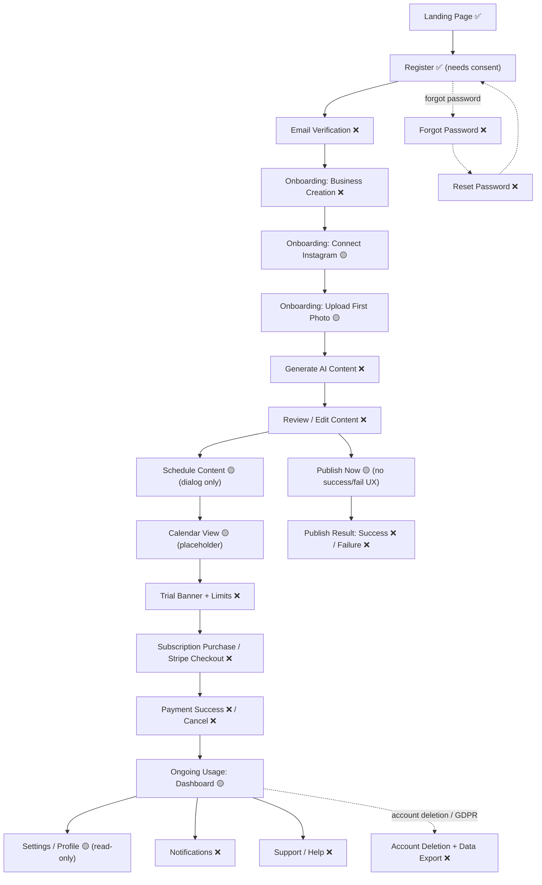

# Klicklocal — Customer Journey Screen Audit & Launch-Readiness Checklist

**Auditor view: Senior SaaS Product Auditor**
**Scope: every screen from Landing → Ongoing Usage**

Legend: ✅ Exists · 🟡 Partial / needs rework · ❌ Missing

---

## 1. User Flow Diagram



**Critical breaks in the chain:** the journey is severed at **Email Verification → Business Creation → AI Generation → Review** (the product's core loop), and again at **Subscription Purchase** (no way to pay). These are non-negotiable launch blockers.

---

## 2. Missing Screens (summary)

| # | Screen | Status | Journey Stage |
|---|---|---|---|
| 1 | Email Verification + Notice Banner | ❌ | Post-register |
| 2 | Forgot Password | ❌ | Recovery |
| 3 | Reset Password | ❌ | Recovery |
| 4 | Onboarding Wizard (shell + progress) | ❌ | Activation |
| 5 | Business Creation / Profile | ❌ | Activation |
| 6 | Connect Instagram (guided step) | 🟡 | Activation |
| 7 | Upload First Product Photo (guided) | 🟡 | Activation |
| 8 | AI Content Generation | ❌ | Core loop |
| 9 | Review / Edit Generated Content | ❌ | Core loop |
| 10 | Schedule Content (full screen, not just dialog) | 🟡 | Core loop |
| 11 | Calendar (functional) | 🟡 | Core loop |
| 12 | Publish Confirmation + Result | ❌ | Core loop |
| 13 | Plans / Pricing (in-app) | 🟡 | Monetization |
| 14 | Stripe Checkout handoff | ❌ | Monetization |
| 15 | Payment Success | ❌ | Monetization |
| 16 | Payment Cancelled | ❌ | Monetization |
| 17 | Trial Status / Upgrade Prompt | ❌ | Monetization |
| 18 | Editable Profile + Change Password | 🟡 | Ongoing |
| 19 | Notifications Center | ❌ | Ongoing |
| 20 | Account Deletion + Data Export (GDPR) | ❌ | Ongoing |
| 21 | Help / Support / Contact | ❌ | Ongoing |
| 22 | Legal: Impressum / Datenschutz / AGB | ❌ | Compliance |
| 23 | Cookie Consent Banner | ❌ | Compliance |

---

## 3. Missing Components

- `OnboardingStepper` (progress + step navigation, mobile-first)
- `BusinessProfileForm` (industry select, brand tone, services, location)
- `AiGeneratorPanel` (idea input, tone selector, variant cards, regenerate)
- `AiVariantCard` (caption + hashtags, copy/insert/edit)
- `MediaUploader` reusable with drag-drop + progress (guided variant for onboarding)
- `CalendarView` (month/week) + `CalendarPostChip`
- `SchedulePicker` (date/time, German locale, timezone-aware) as standalone
- `PublishResultToast` / `PublishStatusBadge` (success/processing/failed + retry)
- `TrialBanner` and `QuotaMeter` (reusable, plan-aware)
- `StripeCheckoutButton` (redirect handoff) + `BillingPortalButton`
- `CookieConsentBanner`
- `NotificationBell` + `NotificationList`
- `ConfirmDialog` (destructive actions: delete account, cancel sub)
- `ErrorBoundary` + global `error.tsx` / `loading.tsx`
- `EmptyState` variants for AI, calendar, analytics (extend existing)
- `ConsentCheckbox` (AGB/Datenschutz acceptance)
- Email templates (German): welcome, verify, reset, trial-ending, receipt, publish-failed

---

## 4. Missing Database Tables / Columns

**New tables:**
- `business_profiles` *(or extend `workspaces`)*: `workspace_id`, `industry`, `business_name`, `address`, `city`, `postal_code`, `phone`, `website`, `brand_tone`, `target_audience`, `services` (json), `logo_path`, `brand_color`, `default_language`
- `ai_generations`: `workspace_id`, `user_id`, `type` (caption|weekly_plan|reply), `input`, `result`, `tokens_used`, `created_at`
- `notifications` (Laravel standard)
- `post_metrics` *(Phase 2)*: `post_id`, `reach`, `likes`, `comments`, `fetched_at`

**Column additions:**
- `users`: `terms_accepted_at`, `privacy_accepted_at`, `marketing_opt_in`, `deleted_at` (soft delete) — note `email_verified_at` already exists, just unused
- `workspaces`: `onboarding_completed_at`, `onboarding_step`, `stripe_customer_id`
- `plans`: `stripe_price_id`
- `subscriptions`: `stripe_subscription_id`, `stripe_customer_id`, `trial_reminded_at`
- `social_accounts`: `token_expires_at`, `needs_reconnect`
- `posts`: `failure_reason`, `published_at` (if absent)
- `invoices`: `invoice_number` (sequential), `vat_rate`, `vat_amount`, `seller_details`, `pdf_path`

---

## 5. Missing API Endpoints

```txt
POST   /api/v1/auth/forgot-password
POST   /api/v1/auth/reset-password
POST   /api/v1/auth/email/verify
POST   /api/v1/auth/email/resend
PUT    /api/v1/auth/profile
PUT    /api/v1/auth/password
DELETE /api/v1/auth/account                 (GDPR right to erasure)
GET    /api/v1/auth/data-export             (GDPR data portability)

GET    /api/v1/workspaces/{id}/profile      (business profile)
PUT    /api/v1/workspaces/{id}/profile
PATCH  /api/v1/workspaces/{id}/onboarding

POST   /api/v1/ai/generate                  (quota: ai_monthly_tokens)

POST   /api/v1/billing/checkout             (Stripe Checkout session URL)
GET    /api/v1/billing/portal               (Stripe Customer Portal URL)
# harden existing: POST /api/v1/webhooks/stripe (real signature verification)

GET    /api/v1/notifications
POST   /api/v1/notifications/{id}/read

POST   /api/v1/support/contact             (optional)
POST   /api/v1/webhooks/meta/data-deletion (Meta App Review requirement)
GET    /api/v1/analytics                    (Phase 2)
```

---

## 6. Missing UX Improvements

- **No first-run guidance** — user lands on empty dashboard; needs onboarding wizard with progress.
- **No "next best action"** — dashboard should suggest "Connect Instagram", "Generate your first post".
- **Calendar is a dead placeholder** — primary planning surface is unusable.
- **Schedule is a cramped dialog** — promote to a proper picker with German date/time + timezone clarity.
- **No optimistic/loading feedback** on several data pages (billing, usage, invoices, social-accounts).
- **No global error recovery** — missing `error.tsx`, error boundaries; broken screens = blank pages.
- **No trial/quota visibility** — users hit limits with no warning or upgrade path.
- **localStorage token** — XSS exposure; consider hardened storage + auth throttling.
- **No mobile-localized strings** (English-only) and no in-app help.
- **Forgot-password link absent** on login — dead end for locked-out users.

---

## 7. Missing Success States

- ✉️ Verification email sent / email verified confirmation
- 🔑 Password reset successful → redirect to login
- 🏪 Business profile saved (onboarding step complete)
- 📷 Photo uploaded successfully (with thumbnail)
- ✨ AI content generated (variants ready, "inserted into post" toast)
- 🗓️ Post scheduled (with confirmed date/time + "view on calendar")
- 🚀 Post published successfully (with link to live Instagram post)
- 💳 Payment successful → subscription active + receipt sent
- 🎉 Onboarding complete celebration / "you're ready" state
- ✅ Account deleted / data export ready confirmation

---

## 8. Missing Error States

- ❌ Email already registered / invalid email at register
- ❌ Invalid or expired reset/verification token
- ❌ Login throttled (too many attempts) — *currently no throttle at all*
- ❌ Instagram OAuth denied / token expired / reconnect required
- ❌ Media upload failed / file too large / wrong format
- ❌ AI generation failed / quota exceeded (ai_monthly_tokens)
- ❌ Schedule in the past / invalid date
- ❌ Publish failed (provider error) + reason + retry — *currently silent*
- ❌ Payment failed / card declined / checkout cancelled
- ❌ Trial expired → feature locked + upgrade CTA
- ❌ Network/server error global boundary (German, friendly, retry)

---

## Per-Screen Specifications

### Screen 1 — Email Verification ❌
- **Purpose:** Confirm email validity so resets/receipts arrive; reduce bot signups.
- **Required Fields:** none (signed token via email); resend uses authed user.
- **Required Actions:** Auto-verify on link click; "Resend email"; "Continue to dashboard".
- **API:** `POST /auth/email/verify`, `POST /auth/email/resend`.
- **Acceptance:** Clicking valid link sets `email_verified_at` and shows success; expired/invalid token shows clear error + resend; unverified users see a persistent banner.

### Screen 2 — Forgot Password ❌
- **Purpose:** Start account recovery.
- **Required Fields:** `email`.
- **Required Actions:** Submit; success message ("Falls ein Konto existiert…"); back to login.
- **API:** `POST /auth/forgot-password`.
- **Acceptance:** Always returns neutral success (no account enumeration); throttled; email sent if account exists.

### Screen 3 — Reset Password ❌
- **Purpose:** Set new password from emailed token.
- **Required Fields:** `password`, `password_confirmation` (token+email from URL).
- **Required Actions:** Submit → redirect to login with success.
- **API:** `POST /auth/reset-password`.
- **Acceptance:** Valid token updates password & invalidates token; expired token errors clearly; password rules enforced.

### Screen 4 — Onboarding Wizard ❌
- **Purpose:** Guide new owner from signup to first published-ready post.
- **Required Fields:** progress state per step.
- **Required Actions:** Next/Back/Skip; resume where left off.
- **API:** `PATCH /workspaces/{id}/onboarding`, plus step APIs.
- **Acceptance:** Steps persist; skippable steps don't block; completion sets `onboarding_completed_at`; mobile-first responsive.

### Screen 5 — Business Creation / Profile ❌
- **Purpose:** Capture business identity that powers AI personalization.
- **Required Fields:** `business_name`, `industry` (restaurant/café/barber/nail studio/beauty salon/other), `city`, `address`, `brand_tone`, `services`, optional `logo`, `brand_color`, `website`.
- **Required Actions:** Save & continue.
- **API:** `PUT /workspaces/{id}/profile`.
- **Acceptance:** Profile saved and editable later; required fields validated; values feed AI prompt context.

### Screen 6 — Connect Instagram (guided) 🟡
- **Purpose:** Link the IG Business account for publishing.
- **Required Fields:** none (OAuth).
- **Required Actions:** "Mit Instagram verbinden", handle callback, show connected account, disconnect, reconnect.
- **API:** existing `GET /social-accounts/instagram/connect|status`, `POST .../disconnect` (flip to live `api` driver).
- **Acceptance:** OAuth completes & shows handle/avatar; denial/expiry shows reconnect; skippable in onboarding.

### Screen 7 — Upload First Product Photo (guided) 🟡
- **Purpose:** Provide media for the first AI post.
- **Required Fields:** image file.
- **Required Actions:** Drag-drop/select, progress, preview, set as post image.
- **API:** existing `POST /media/upload`, `GET /media`.
- **Acceptance:** Upload shows progress + thumbnail; oversized/invalid type errors; selected photo carried into composer.

### Screen 8 — AI Content Generation ❌
- **Purpose:** Turn a short idea + business profile into on-brand German captions.
- **Required Fields:** `idea/topic`, `tone` (defaults from profile), `type` (caption/weekly plan).
- **Required Actions:** Generate, regenerate, pick variant, edit, insert into post.
- **API:** `POST /ai/generate` (quota `ai_monthly_tokens`).
- **Acceptance:** Returns ≥3 variants with hashtags in German; respects brand tone; quota enforced with clear error; failures retryable.

### Screen 9 — Review / Edit Content ❌
- **Purpose:** Let owner refine AI output before scheduling/publishing.
- **Required Fields:** `content`, attached `media`, target platform.
- **Required Actions:** Edit caption, swap image, save draft, proceed to schedule/publish.
- **API:** `POST/PUT /posts`.
- **Acceptance:** Edits persist as draft; character/format constraints shown; preview reflects Instagram layout.

### Screen 10 — Schedule Content 🟡
- **Purpose:** Pick a future publish time.
- **Required Fields:** `scheduled_at` (date/time, timezone).
- **Required Actions:** Confirm schedule; edit/cancel later.
- **API:** existing `POST /posts/{id}/schedule` (quota `scheduled_posts_monthly`).
- **Acceptance:** Past dates rejected; German locale; quota enforced; appears on calendar.

### Screen 11 — Calendar 🟡
- **Purpose:** Visual overview of scheduled/published posts.
- **Required Fields:** none.
- **Required Actions:** View month/week, click to edit, drag-to-reschedule.
- **API:** existing posts endpoints (filter by date).
- **Acceptance:** Renders posts by date with status colors; empty state guides creation; reschedule calls update API.

### Screen 12 — Publish Confirmation + Result ❌
- **Purpose:** Publish now and report outcome.
- **Required Fields:** none.
- **Required Actions:** Confirm publish; show processing; success (link to live post) or failure (reason + retry).
- **API:** existing `POST /posts/{id}/publish`.
- **Acceptance:** Status transitions visible; success links to IG post; failure shows reason + retry + notifies user.

### Screen 13 — Plans / Pricing (in-app) 🟡
- **Purpose:** Present plans and start purchase.
- **Required Fields:** plan selection.
- **Required Actions:** Compare plans, "Jetzt abonnieren".
- **API:** `GET /billing`, `POST /billing/checkout`.
- **Acceptance:** Plans show EUR pricing + features + trial; CTA initiates Stripe Checkout.

### Screen 14 — Stripe Checkout Handoff ❌
- **Purpose:** Securely collect payment (hosted).
- **Required Fields:** handled by Stripe (card/SEPA).
- **Required Actions:** Redirect to Stripe; return to success/cancel.
- **API:** `POST /billing/checkout` → session URL; webhook activation.
- **Acceptance:** German Checkout locale; cards + SEPA enabled; webhook signature verified; subscription activates on `checkout.session.completed`.

### Screen 15 — Payment Success ❌
- **Purpose:** Confirm active subscription.
- **Required Fields:** none.
- **Required Actions:** Continue to dashboard; download receipt.
- **API:** `GET /subscription`, `GET /invoices`.
- **Acceptance:** Shows active plan + next billing date; receipt email sent; quotas updated.

### Screen 16 — Payment Cancelled ❌
- **Purpose:** Graceful recovery after abandoned checkout.
- **Required Actions:** Retry checkout; back to plans.
- **API:** `POST /billing/checkout`.
- **Acceptance:** No charge made; clear "try again" path; trial unaffected.

### Screen 17 — Trial Status / Upgrade Prompt ❌
- **Purpose:** Drive trial→paid conversion.
- **Required Fields:** none.
- **Required Actions:** View days remaining; upgrade CTA.
- **API:** `GET /billing` (trial_ends_at).
- **Acceptance:** Banner shows accurate days left; on expiry, features gate with upgrade prompt; reminder emails sent.

### Screen 18 — Editable Profile + Change Password 🟡
- **Purpose:** Self-service account management.
- **Required Fields:** `name`, `email`, current/new password.
- **Required Actions:** Save profile; change password.
- **API:** `PUT /auth/profile`, `PUT /auth/password`.
- **Acceptance:** Updates persist; password change requires current password; email change re-verifies.

### Screen 19 — Notifications Center ❌
- **Purpose:** Surface publish results, trial, system messages.
- **Required Actions:** View, mark read.
- **API:** `GET /notifications`, `POST /notifications/{id}/read`.
- **Acceptance:** Unread badge; publish-failure/trial notifications appear; mark-read persists. *(Phase 2; email covers launch.)*

### Screen 20 — Account Deletion + Data Export ❌
- **Purpose:** GDPR Art. 17 / 20 compliance.
- **Required Fields:** confirmation.
- **Required Actions:** Export my data (JSON); delete account (confirm).
- **API:** `GET /auth/data-export`, `DELETE /auth/account`.
- **Acceptance:** Export returns user+workspace data; deletion soft-deletes then purges + revokes tokens; confirmation required.

### Screen 21 — Help / Support / Contact ❌
- **Purpose:** Give first customers a fast support channel.
- **Required Fields:** message/email (or external widget).
- **Required Actions:** Contact support; view FAQ.
- **API:** `POST /support/contact` (optional) or external widget.
- **Acceptance:** Reachable from sidebar; submission confirmed; response path defined.

### Screen 22 — Legal Pages (Impressum / Datenschutz / AGB) ❌
- **Purpose:** Mandatory German compliance (TMG/DDG + GDPR); also unblocks Meta App Review.
- **Required Actions:** Read static legal content; reachable from footer + register.
- **API:** none (static) + Meta data-deletion webhook.
- **Acceptance:** Real pages at `/impressum`, `/datenschutz`, `/agb` (footer anchors currently dead); Privacy Policy publicly reachable for Meta.

### Screen 23 — Cookie Consent Banner ❌
- **Purpose:** GDPR/ePrivacy consent before non-essential cookies/analytics.
- **Required Actions:** Accept/Reject/Manage.
- **API:** none.
- **Acceptance:** Non-essential scripts load only after consent; choice persisted; reopenable.

---

## Launch-Readiness Checklist

**🔴 Blockers — cannot launch without (Phase 1)**
- [ ] Transactional email working (enables verify, reset, receipts, alerts)
- [ ] Forgot Password + Reset Password screens
- [ ] Onboarding wizard + Business Creation screen
- [ ] AI Content Generation screen (OpenAI wired, profile-aware)
- [ ] Review/Edit generated content
- [ ] Stripe Checkout + Payment Success/Cancel screens (real payments)
- [ ] Trial enforcement + Trial banner/upgrade prompt
- [ ] Instagram live `api` driver + Meta App Review submitted
- [ ] Publish result success/failure states + notifications
- [ ] Legal: Impressum, Datenschutz, AGB pages (real, not anchors)
- [ ] Cookie consent banner
- [ ] Account deletion + data export (GDPR)
- [ ] Auth rate limiting + Stripe webhook signature verification
- [ ] Register consent checkboxes (AGB/Datenschutz) + confirm-password
- [ ] Editable profile + change password
- [ ] Help/Support contact channel

**🟡 Strongly recommended before/just after launch**
- [ ] Email verification (notice + resend)
- [ ] Functional Calendar view
- [ ] Promote schedule dialog → full picker
- [ ] Global error boundary + loading/error states
- [ ] Dashboard "next best action" + quota meters

**🟢 Phase 2+ (first 50–500)**
- [ ] Notifications center (in-app)
- [ ] Instagram analytics / post metrics
- [ ] Stripe Customer Portal + German invoice PDFs (USt)
- [ ] Mobile feature parity (German)
- [ ] Additional channels (Facebook, TikTok), team approvals

---

**Bottom line:** The customer journey has **23 screen-level gaps**, of which **16 are hard launch blockers**. The chain breaks worst at **AI Generation → Review** (your core value) and **Subscription Purchase** (your revenue). Everything needed to *publish* a post already exists — the missing pieces are *creating value with AI*, *getting paid*, and *being legal in Germany*.
